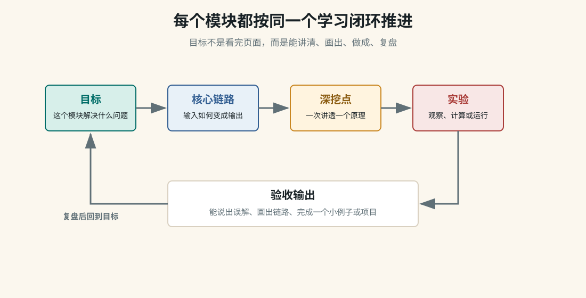

> Digital Twin City

# 数字孪生城市系统：把地图、三维、实时数据和 Agent 串起来

数字孪生城市不是“做一个好看的三维大屏”。真正的系统要能接入城市资产、地图底座、三维模型、传感器、车辆、摄像头、告警、历史时序数据和 AI Agent 分析能力，让用户能看见、查询、推演、处置和复盘。



## 一句话总览

```text
城市数据源
  -> 数据接入与治理
  -> 空间数据库 / 时序数据库 / 对象存储
  -> 瓦片服务 / 3D Tiles / API
  -> Mapbox / Cesium / OpenLayers 前端
  -> Agent 工具调用：查询、分析、告警解释、生成处置建议
  -> 人在前端确认和执行
```

## 系统分层

### 地图底座

Mapbox 负责轻量二维矢量地图，Cesium 负责三维地球、3D Tiles、地形和大范围空间场景，OpenLayers 可做传统 GIS 管理型页面。

### 三维资产

包括 3D Tiles、BIM、倾斜摄影、点云、地形、建筑白模、高斯泼溅重建结果。重点是格式、LOD、坐标和更新流程。

### 实时数据

车辆位置、IoT 传感器、摄像头状态、管网压力、告警事件、人员轨迹通过消息队列和时序库进入系统。

### Agent 分析

Agent 不直接“控制城市”，而是调用受控工具：空间查询、时序分析、告警聚合、图层开关、报表生成、应急预案检索。

### 前端交互

图层树、时间轴、对象选中、属性面板、告警面板、测量、剖切、路径回放、对话式查询。

### 后端治理

权限、审计、数据质量、服务降级、缓存、监控、任务队列、模型调用成本控制。

## 建议学习顺序

| 阶段 | 页面 | 学会什么 |
| --- | --- | --- |
| 先定边界 | 模块总览 | 数字孪生不是大屏，而是城市数据、地图场景、实时状态和处置流程的系统。 |
| 选地图底座 | 地图底座 | 什么时候用 Mapbox，什么时候用 Cesium，传统 GIS 页面为什么还会用 OpenLayers。 |
| 接三维资产 | 三维资产与数据 | BIM、3D Tiles、倾斜摄影、点云、高斯泼溅分别解决什么问题。 |
| 接实时状态 | 实时数据与 Agent | 告警、传感器、轨迹数据如何进入地图，Agent 如何调用受控工具。 |
| 落成产品 | MVP 路线 | 先做可运行闭环，再逐步扩展图层、资产、告警和分析能力。 |

## 和已有模块的关系

| 已有模块 | 在数字孪生中的角色 |
| --- | --- |
| Cesium | 三维地球、3D Tiles、地形、卫星/飞行路径、倾斜摄影。 |
| Mapbox | 二维业务地图、矢量瓦片、道路、POI、城市运营图层。 |
| OpenLayers | 传统 GIS 管理、投影、WMS/WFS、测绘业务页面。 |
| Gaussian Splatting | 小范围真实场景重建，例如街区、园区、室内外局部。 |
| Pi Agent / Mini Agent | 自然语言查询、工具调用、自动分析、生成报告。 |
| 量化模块 | 实时信号、策略规则、风控、监控和回测思路可迁移到城市告警系统。 |

## 读完要能回答

- Mapbox、Cesium、OpenLayers 在城市系统里怎么分工？

- 3D Tiles、BIM、倾斜摄影、点云、高斯泼溅分别解决什么问题？

- 实时数据从设备到前端要经过哪些队列、数据库和 API？

- Agent 能调用哪些工具，哪些操作必须让人确认？

- 一个最小可运行数字孪生 Demo 应该先做哪些功能？

## 验收标准

```text
能画出：设备数据 -> 后端服务 -> 地图图层 -> Agent 工具调用 -> 人工确认。
能区分：Mapbox、Cesium、OpenLayers 在同一城市系统里的职责。
能解释：3D Tiles、BIM、点云、倾斜摄影、高斯泼溅的适用边界。
能设计：一个只包含地图、一个实时对象、一个告警和一个 Agent 查询工具的 MVP。
能指出：哪些操作必须人工确认，不能让 Agent 直接执行。
```

下一步
[[10 - 数字孪生城市/01 - 地图底座怎么选：Mapbox、Cesium、OpenLayers 如何分工|看地图底座怎么分工]]
