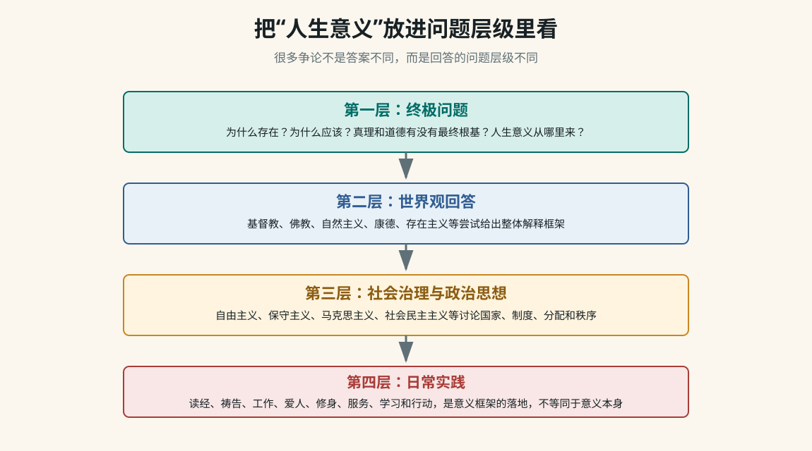

> Worldview Deep Dive

# 从“人生意义”到世界观、道德与政治思想

这页整理一段围绕“人生意义”的长对话。它不是要替你选择某个信仰或立场，而是把对话中出现的追问完整拆开：圣经如何回答意义，为什么实践建议仍可能让人觉得空，宗教、哲学、政治思想分别回答什么层级的问题，道德根基从哪里来，以及基督教内部的罪、死亡、十字架和复活如何连成一个解释框架。

新拆分
[[17 - 哲学与世界观/00 - 哲学与世界观|哲学模块负责世界观分析]]

新拆分
[[18 - 基督教基础/00 - 基督教基础|基督教模块负责圣经与福音逻辑]]



## 一、先看整段对话到底在追问什么

对话表面上从“圣经中人生意义是什么”开始，实际一路推进到更底层的问题：如果一个答案说“你应该爱神爱人”，还可以继续问“为什么应该”；如果一个答案说“为了社会进步”，还可以继续问“为什么社会进步值得”；如果一个答案说“自己创造意义”，还可以继续问“自造意义为什么能约束我”。这就是终极问题的特点：它会追问到不能再依赖更高理由为止。

| 阶段 | 用户真正卡住的点 | 知识库要保留的内容 |
| --- | --- | --- |
| 圣经答案 | 人生意义能不能简洁概括？ | 荣耀神、爱神爱人、认识神、效法基督、与神同在。这是基督教给出的意义框架，不只是行为清单。 |
| 实践建议 | 读经、祷告、顺服、爱人、传福音，听起来像任务，为什么要做？ | 方法不是意义本身。实践必须从“我是谁、神是谁、我与神和他人的关系是什么”里流出，否则会变成空动作。 |
| 没感觉 | 答案听懂了，但内心没有被打动。 | 理性理解、情绪共鸣、生命确信是三件事。没有感觉不等于问题无效，也不等于人懒。 |
| 终极追问 | 为什么值得？为什么应该？为什么必须活着？ | 进入终极理由问题。普通建议回答“怎么做”，终极问题追问“为什么做值得”。 |
| 比较世界观 | 基督教、佛教、自然主义、存在主义、康德、马克思主义谁更能解释人生意义？ | 比较标准不能只看人数、传统、政治力量或情绪吸引力，而要看解释力、自洽性、反驳处理和实践后果。 |
| 政治思想边界 | 政党、主义、制度能不能回答人生意义？ | 政治思想主要回答治理、分配、秩序、权利、国家与社会组织方式，不一定回答存在、真理、死亡和终极价值。 |
| 道德根基 | 如果没有神，为什么还要讲道德、理性、美好？ | 进入元伦理学：道德可能被解释为神圣根基、理性法则、进化策略、社会契约、功利计算或德性实践。 |
| 基督教核心 | 罪、死亡、代赎、复活到底为什么连在一起？ | 基督教把罪理解为人与神关系断裂；十字架不是普通牺牲，而是以耶稣身份为前提的救赎事件；复活是死亡被胜过和身份被显明。 |
| 祷告与寻找 | 如果还不信，应该怎么开始？ | 可以从诚实祷告和阅读四福音开始，不需要用漂亮语言；重点是把问题带到“耶稣到底是谁”。 |

## 二、最关键的整理：四个问题层级

这段对话最容易混乱的地方，是把不同层级的问题放在一起比较。比如拿政党去回答“为什么存在”，或者拿读经祷告去回答“为什么值得活着”，都会觉得不对味。更清楚的分层如下：

```text
第一层：终极问题
  为什么存在？真理是什么？人为什么有尊严？为什么应该行善？
  死亡意味着什么？痛苦有没有意义？人生为什么值得？

第二层：世界观回答
  基督教、佛教、伊斯兰教、自然主义、存在主义、康德哲学、
  马克思主义等，尝试给出整体解释。

第三层：社会治理与政治思想
  自由主义、保守主义、马克思主义、社会民主主义、民族主义、
  政党和政策，主要讨论权力、制度、分配、秩序和公共生活。

第四层：日常实践
  读经、祷告、修行、工作、学习、爱人、劳动、服务、投票、
  写作、承担责任、建设共同体。
```

一个成熟的知识库要把这四层都放进去，但不能混成一团。第一层决定“为什么值得”，第二层给出整体解释，第三层处理共同生活，第四层落实到行动。

## 三、圣经中人生意义可以怎样概括

对话里最早的回答可以压缩成一句话：从基督教看，人生意义是认识神、荣耀神、爱神爱人，并在基督里恢复人与神的关系。这个答案包含几个层面：

| 表达 | 意思 | 容易误解的地方 |
| --- | --- | --- |
| 荣耀神 | 人的生命不是只围绕自我欲望旋转，而是指向创造者、真理和善。 | 容易被误解成神需要人吹捧；更准确地说，是人的生命活出神所设定的美善秩序。 |
| 爱神爱人 | 意义不只是思想结论，也表现为关系：对神的爱、对人的爱、对邻舍的责任。 | 容易变成道德任务清单；但在基督教里，它来自先被神所爱。 |
| 认识神 | 人生不是先找一堆事情填满，而是认识最终真实者，并在关系中被改变。 | 如果只是概念认识，没有关系和实践，就会显得抽象。 |
| 效法基督 | 用耶稣的生命样式理解爱、牺牲、真理、服事和饶恕。 | 不能只理解成模仿好人；基督教的前提是耶稣的身份决定祂不仅是榜样。 |
| 与神同在 | 最终目标不是完成 KPI，而是关系恢复、生命被更新、人与神和好。 | 如果只问“能给我什么好处”，就会错过它的关系性。 |

## 四、为什么“读经、祷告、顺服、爱人”仍可能显得没意义

对话中很重要的一步，是用户说这些实践听起来仍然“没意思”。这里不能简单回答“你去做就好了”。更准确的分析是：

- 实践不是终极理由： 读经、祷告、爱人、传福音是路径，不是终点。如果人还不知道为什么这条路值得，路径本身就像外部任务。

- 意义不是即时情绪： 有些意义来自长期关系和反复实践，不一定在第一天就带来强烈感觉。

- 人可能在追问更底层的问题： 当一个人不断问“为什么值得”，说明他要的不是技巧，而是终极根据。

- 心理状态也要被认真对待： 长期对一切失去兴趣、动力、希望，不一定只是哲学问题，也可能需要专业心理或医学帮助。

## 五、世界观比较：不要用一个指标偷懒

对话里反复出现一个判断：支持人数、社会影响力、解释力、真实性、实践效果不是同一件事。一个世界观人数多，不等于它真；一个理论能动员群众，不等于它能回答终极意义；一个说法让人舒服，也不等于它可靠。

| 评估维度 | 要问的问题 | 典型误区 |
| --- | --- | --- |
| 支持人数 | 多少人信？为什么能长期流传？有什么组织和文化基础？ | 把多数人相信当成真理证明。 |
| 解释力 | 能否解释存在、道德、理性、人格尊严、痛苦、死亡、盼望和社会冲突？ | 只看它解释得好的部分，不看解释不了的部分。 |
| 内部一致性 | 核心概念之间是否冲突？前提和结论是否一致？ | 用模糊词遮住矛盾。 |
| 反驳处理 | 能否面对最强反对意见，例如苦难问题、启示可信性、客观道德根基、科学解释边界？ | 只读支持者，不读批评者。 |
| 实践后果 | 它会塑造怎样的人、家庭、共同体、制度和历史行动？ | 把“有用”直接等同于“真实”。 |
| 个人可活性 | 这个世界观能不能被真实地生活出来，而不只是口头说说？ | 把概念胜利当成生命答案。 |

## 六、几个世界观如何回答人生意义

| 世界观 | 意义的典型回答 | 它擅长解释 | 常被追问 |
| --- | --- | --- | --- |
| 基督教 | 人被神创造，为认识神、荣耀神、爱神爱人，并在基督里与神和好。 | 存在、人格尊严、客观道德、罪、救赎、盼望、爱和死亡。 | 神是否存在？启示是否可信？苦难为什么存在？耶稣身份是否成立？ |
| 伊斯兰教 | 人生意义在于顺服独一真主，按启示和律法生活，接受审判。 | 神圣命令、秩序、共同体规范、敬畏与顺服。 | 启示来源如何判断？人与神关系中恩典和律法如何理解？ |
| 佛教 | 认识苦、集、灭、道，断除无明与执着，离苦得解脱。 | 痛苦、欲望、自我执着、修行路径和心识观察。 | 客观道德根基、创造者、人格性终极关系如何理解？ |
| 印度教传统 | 在业、轮回、法、梵我关系中理解人生，追求解脱。 | 宇宙秩序、轮回、业报、修行和灵性层级。 | 个人人格、社会等级传统和终极真实之间如何协调？ |
| 儒家 | 人在修身、齐家、责任、仁义礼智和社会伦理中成其为人。 | 家庭、秩序、德性、教育、责任、社会角色。 | 终极存在、死亡、救赎和超越性根据不是其主要焦点。 |
| 道家 | 顺应道，减少人为执着，回到自然、无为和生命本真。 | 反思功利、权力、欲望和过度控制。 | 公共制度、历史行动和客观伦理约束如何建立？ |
| 自然主义 | 宇宙没有预设目的，人依靠科学、理性、共情和选择创造意义。 | 与现代科学方法兼容，重视经验、证据和人类合作。 | 客观道德、理性可靠性、人格尊严和终极意义是否有根基？ |
| 存在主义 | 没有预设意义，人通过自由选择、承担责任和诚实面对处境来创造意义。 | 焦虑、自由、荒诞、个体处境和责任。 | 自造意义为什么不只是主观偏好？它如何约束他人？ |
| 康德哲学 | 人作为理性存在者，应按义务和道德法则行动，并把人当作目的。 | 人格尊严、义务、道德法则、实践理性。 | 为什么实践理性会需要上帝、自由和灵魂不朽这些设定？ |
| 马克思主义 | 人在劳动、社会实践、共同体和人的全面发展中实现价值。 | 阶级、资本、劳动异化、制度压迫、社会变革。 | 存在本身、死亡、客观道德和终极意义不是它最核心的问题。 |

## 七、政治思想和政党为什么回答不了全部问题

对话中有一条很重要的线：政治思想很强，但它不是万能的。政党和意识形态能回答“社会应该如何组织”，却通常不直接回答“宇宙为什么存在”“死亡有没有终极意义”“人为什么有不可侵犯的尊严”。

| 问题 | 宗教/哲学更常处理 | 政治思想/政党更常处理 |
| --- | --- | --- |
| 为什么存在？ | 宇宙、神、终极真实、存在本身。 | 通常不是核心问题。 |
| 为什么应该行善？ | 神的本性、道德法则、义务、善、实践理性、业力或德性。 | 法律、权利、社会契约、公共秩序、共同利益。 |
| 人生意义是什么？ | 与神同在、解脱、德性、自我创造、终极目标。 | 劳动、自由、共同体、民族、阶级、社会贡献。 |
| 社会为什么不公？ | 罪、欲望、无明、人性、权力、堕落或道德失败。 | 阶级、制度、市场失灵、资源分配、国家能力。 |
| 应该怎么治理？ | 提供价值前提和人性判断。 | 税收、福利、市场、政府、法律、组织方式、政策工具。 |

所以政治思想可以成为人生意义的一部分，例如为了公共正义、劳动解放、民族复兴、自由权利而行动；但如果它被要求回答所有终极问题，就会超出自己的能力边界。

## 八、道德、理性和美好从哪里来

当对话追问“没有神为什么还要讲道德、理性和美好”时，问题进入元伦理学。这里不是问“人会不会做好事”，而是问“善为什么真的有约束力”。几种常见回答如下：

| 路线 | 核心说法 | 强处 | 难点 |
| --- | --- | --- | --- |
| 神圣根基 | 善根源于神的本性，人的尊严来自人按神形象被造。 | 给客观道德和人格尊严提供超越根据。 | 需要回答神是否存在、启示是否可信、苦难问题。 |
| 进化解释 | 道德感来自合作、亲缘选择、群体生存和社会演化。 | 能解释为什么人类会形成同情、合作和惩罚机制。 | 解释“为什么会有”不等于证明“为什么应该”。 |
| 社会契约 | 为了共同生活，人们约定规则、权利和义务。 | 适合解释法律、制度和公共秩序。 | 如果契约对我不利，我为什么必须遵守？ |
| 功利主义 | 应最大化幸福、减少痛苦。 | 清楚、可计算，适合公共政策权衡。 | 少数人的尊严是否会被多数人的收益牺牲？ |
| 康德义务论 | 理性要求我们按可普遍化的道德法则行动，把人当作目的。 | 强烈保护人格尊严和义务。 | 实践理性为什么具有最终权威？最高善如何可能？ |
| 德性伦理 | 道德是人成为好人、形成德性、活出良好生命的过程。 | 重视人格养成和长期实践。 | 不同传统对“好人”的定义可能冲突。 |

## 九、康德的实践理性为什么重要

对话里提到康德，是因为康德把“我能知道什么”和“我应该做什么”分开。理论理性处理知识，实践理性处理道德行动。康德不是用理论理性像数学定理那样证明上帝，而是认为道德生活会要求某些设定。

```text
理论理性：我能知道什么？
  例子：自然如何运行，因果关系是什么，经验知识如何可能。

实践理性：我应该做什么？
  例子：我该不该撒谎？我是否应尊重他人？我是否必须按义务行动？

康德的问题：
  如果人应当追求善，
  但现实中善与幸福并不总是匹配，
  那么实践理性会要求最高善成为可能。
  这就引出自由、上帝、灵魂不朽这样的实践设定。
```

这解释了为什么“道德为什么有约束力”会把人从伦理学带到宗教哲学。它不是简单情绪问题，而是理性结构问题。

## 十、宗教传统如何理解“罪”或人的根本问题

对话中还比较了不同宗教对人的问题的理解。这里的关键不是把所有宗教说成一样，而是看它们各自把“人为什么不对劲”放在哪里。

| 传统 | 人的根本问题 | 解决方向 |
| --- | --- | --- |
| 基督教 | 罪是人与神关系断裂，不只是违反规则，也包括自我中心、背离神、不能自救。 | 神主动救赎，基督的十字架和复活使人与神和好。 |
| 伊斯兰教 | 人需要顺服真主，罪与违背启示和命令有关。 | 信仰、顺服、悔改、善行、遵行律法。 |
| 佛教 | 根本问题是无明、执着和贪嗔痴，由此产生苦。 | 通过八正道、修行、智慧和慈悲离苦。 |
| 印度教传统 | 人被业和轮回束缚，未认识终极真实。 | 通过知识、行动、虔信、瑜伽等道路趋向解脱。 |
| 儒家 | 人需要在关系、礼、仁义和修身中成德。 | 教育、修身、家庭伦理、社会责任。 |
| 道家 | 问题来自人为造作、欲望、控制和违背自然之道。 | 无为、返朴、顺道、减少执着。 |

## 十一、基督教中罪、死亡、十字架和复活的内部逻辑

对话后半段追问：为什么耶稣要死？为什么复活不是“白折腾”？如果耶稣只是普通好人，代赎逻辑确实很难成立；基督教的前提恰恰是耶稣的身份决定了祂的死意味着什么。

```text
罪：
  人与神关系断裂，人以自己为中心，离开生命源头。

死亡：
  不只是生物学停止，也被理解为罪与审判的结果，
  是人与神隔绝的最终表现。

十字架：
  不是普通人替别人受苦，
  而是神在基督里主动承担罪的代价。

复活：
  表明死亡没有最终权柄，
  显明耶稣身份，也显明救赎不是失败而是胜过死亡。
```

所以基督教讨论十字架和复活，核心问题不是“一个好人为什么被杀”，而是“如果耶稣真是基督、神的儿子，那么祂的死和复活对人与神关系意味着什么”。

## 十二、祷告不是漂亮话，而是诚实地寻找

对话里也谈到如何开始祷告。重点不是语气多宗教化，也不是先假装自己已经确定相信，而是诚实地把问题带到神面前。可以用很朴素的表达：

```text
如果你真实存在，请引导我认识你。
如果耶稣真是你所差来的，请让我明白。
我不想只是接受一个概念，也不想逃避真实问题。
请帮助我看见真理，也帮助我诚实面对自己。
```

从学习路径看，研究基督教可以先读四福音。不要一开始陷入所有宗派、历史争论和二手评价，先抓核心问题：耶稣是谁？祂为什么被钉十字架？复活为什么是基督教的中心？

## 十三、把“没感觉”也纳入知识框架

一个人说“我觉得这些都没意思”，不应该被粗暴归类为懒、坏、肤浅。它可能同时包含哲学问题、心理问题和生命经验问题。

| 可能情况 | 表现 | 下一步 |
| --- | --- | --- |
| 意义框架还没建立 | 知道该做什么，却不知道为什么值得。 | 回到终极问题，不急着堆行动建议。 |
| 情绪和理性不同步 | 概念上觉得有道理，但内心没有回应。 | 允许时间、阅读、实践和真实关系慢慢进入。 |
| 长期失去动力 | 很多事情都没兴趣、没希望、没有能量。 | 认真考虑心理咨询、医学帮助或可信任的人际支持。 |
| 被空任务压住 | 别人给了一堆“应该做”，却没有回答“为什么”。 | 区分方法、目标和终极理由。 |
| 正在寻找真正能投入一生的理由 | 普通成功、快乐、效率都显得不够。 | 系统比较世界观，不用情绪或人数快速下结论。 |

## 十四、这段对话形成的学习方法

这不是一页宗教结论，而是一套研究终极问题的方法。以后遇到类似问题，可以按下面步骤走：

- 先判断问题层级：是在问存在、意义、道德、死亡，还是在问制度、政策、行动方法？

- 把候选世界观列出来，不要只选自己已经喜欢或讨厌的。

- 对同一组问题做横向比较：存在、道德、人性、痛苦、死亡、救赎/解脱、社会实践。

- 分别阅读支持理由和最强反对意见，避免只找能证明自己的材料。

- 区分“解释力强”“让我舒服”“社会影响大”“真实”这几件事。

- 把政治思想放在合适位置：它能回答公共生活，但未必能回答终极意义。

- 把实践放在合适位置：行动能帮助理解，但行动本身不是终极理由。

- 如果讨论基督教，把核心问题聚焦到耶稣身份、十字架、复活和人与神关系。

## 十五、完整主题清单：这段对话不要漏掉这些点

- 圣经中人生意义：荣耀神、认识神、爱神爱人、效法基督、与神同在。

- 实践路径：读经、祷告、顺服、爱人、传福音，但它们是路径不是意义本身。

- “没意思”的真实含义：可能是在追问终极理由，而不是在要更多方法。

- 终极问题和普通建议的区别：一个问“为什么值得”，一个问“怎么做”。

- 宗教、哲学、政治思想、政党的问题边界不同。

- 支持人数、历史影响、政治力量、解释力、真实性不能混为一谈。

- 世界观比较要看解释力、自洽性、反驳处理、实践后果和个人可活性。

- 自然主义可以解释很多经验事实，但会被追问客观道德、理性可靠性和终极意义根基。

- 佛教强在痛苦、执着、自我和修行分析，但与人格神、创造和客观道德根基不同。

- 康德区分理论理性和实践理性，实践理性引出自由、上帝、灵魂不朽等道德设定。

- 马克思主义强在制度、阶级、劳动异化和社会变革，但不是专门回答终极存在问题的体系。

- 基督教把罪理解为人与神关系断裂，而不只是行为违规。

- 十字架逻辑依赖耶稣身份：如果祂只是普通人，代赎逻辑就弱；如果祂是基督，意义完全不同。

- 复活不是附加奇迹，而是基督教关于死亡、救赎和耶稣身份的中心。

- 祷告可以从诚实寻找开始，不需要先有完整信仰语言。

- 长期无兴趣、无动力、无希望要认真看待，必要时寻求专业帮助。

## 十六、自测问题

- 为什么“政党好不好”和“人生意义是什么”不是同一类问题？

- 为什么支持人数不能证明一个世界观是真的？

- 自然主义如何解释道德？它最容易被追问的地方在哪里？

- 康德的理论理性和实践理性有什么区别？

- 基督教为什么把“罪”理解为人与神的关系问题？

- 如果耶稣只是普通人，十字架代赎逻辑会遇到什么困难？

- 为什么复活在基督教中不是可有可无的附加故事？

- 如果一个实践让你觉得没意义，如何判断是实践方式有问题，还是意义框架还没有建立？

- 比较世界观时，怎样避免只挑自己喜欢的证据？

## 来源与延伸

- [用户提供的 ChatGPT 分享对话](https://chatgpt.com/share/6a7167f4-0fb4-83e8-9c9b-1942ee40075a?ogimg=plain)

- [[06 - 系统思维/00 - 系统思维|系统思维：用层级和反馈理解复杂问题]]

- [[05 - 认知学习/02 - 为什么“看懂了”不等于“学会了”|认知学习：为什么看懂不等于真正学会]]

- [[16 - 历史与社会/02 - 如何系统学习社会如何运行|社会科学路线：把宗教、哲学和政治放回社会结构中]]
