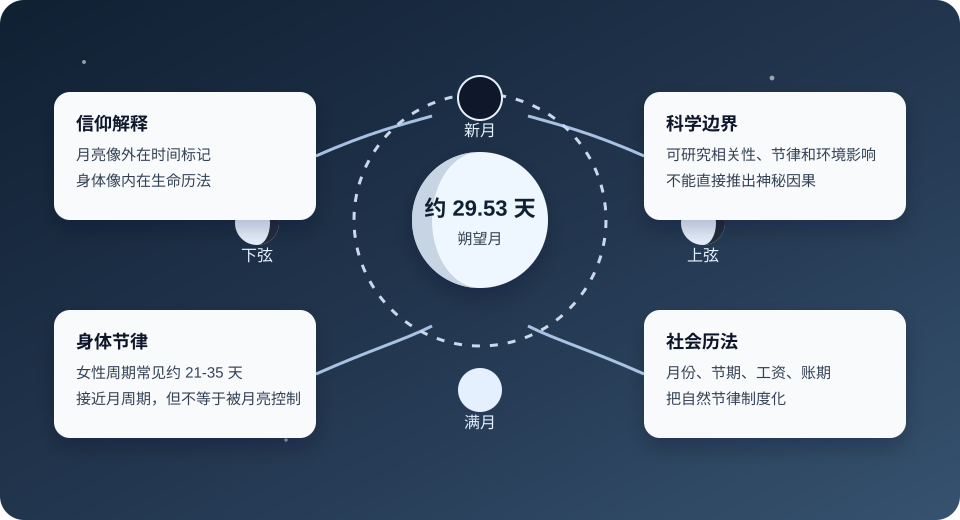

> Philosophy / Religion / Science Boundary

# 为什么月亮约 30 天，人的生理期也接近一个月？

这个问题之所以迷人，是因为它同时碰到天文、身体、历法、宗教象征和人生感受。好的理解方式不是急着说“神秘控制”，也不是把惊奇感抹掉，而是把事实边界、信仰解释和可研究的自然机制分开。



月亮周期提供外在可见节律，身体周期提供内在生命节律，宗教和文化会把它们解释成意义结构。

## 先建立事实边界

| 对象 | 大致周期 | 应该怎样理解 |
| --- | --- | --- |
| 月亮朔望周期 | 约 29.53 天 | 从新月到下一次新月，是人类最容易直接观察到的自然月节律。 |
| 女性月经周期 | 常见约 21-35 天 | 由下丘脑、垂体、卵巢和子宫内膜共同调节，接近一个月，但个体差异很大。 |
| 社会月份 | 约 28-31 天 | 人类把可见天象转化成历法、节期、工资、账期和生活计划。 |
| 七天一周 | 7 天 | 可能与月相四分之一周期、宗教安息结构和社会组织效率共同有关。 |

所以，“一样”不是数学意义上的完全相等，而是都落在一个人类能明显感知、也适合组织生活的中等时间尺度里。

## 从圣经角度可以怎样猜

如果从“神创造世界有秩序”的角度看，月亮和人的身体都不是孤立的。月亮管理夜晚、月份、潮汐、节期；女性身体承担生命孕育、更新、繁衍。两者都和周期、等待、更新、生命有关。

可以这样理解：神让月亮有一个约 30 天的周期，是为了让人类在天空中看见一种可重复的节律；让人的身体也有接近一个月的节律，是为了让生命的预备、更新和繁衍也带着节奏。

```text
月亮
  -> 从黑暗到圆满
  -> 从圆满到亏缺
  -> 再次开始

身体
  -> 预备
  -> 排卵
  -> 等待
  -> 更新

共同主题
  -> 生命不是线性冲刺
  -> 生命带着等待、限制、恢复和重新开始
```

圣经没有直接说“月亮周期对应女性生理期”，但圣经确实把天体和定节令联系起来。创世记中的大光、小光，诗篇中对月亮定节令的表达，都让月亮成为外在时间标记。延伸地说，人的身体也像有一套内在生命历法。

## 为什么 30 天是合适尺度

一天太短，常常只够处理醒来、劳动、饮食和睡眠；一年太长，变化不容易被每天感知。一个月刚好能让人意识到“一个阶段已经过去”。

### 对身体

激素调节、卵泡成熟、子宫内膜变化都需要时间。几周尺度比一天更适合承载繁殖和恢复过程。

### 对心智

一个月足够让人感到变化，又不会长到失去反馈。计划、复盘、悔改、操练都适合按月观察。

### 对社会

月份适合安排节期、债务、工资、市场和农业活动。它把自然节律变成社会秩序。

### 对信仰

月亮的亏缺与圆满很适合承载等待、盼望、更新、受造限制和神设立秩序的象征。

## 其他宗教和文化的看法

| 传统 | 月亮周期的作用 | 可以学到什么 |
| --- | --- | --- |
| 伊斯兰教 | 斋月、开斋节等以阴历月份确定，新月标记月份开始。 | 月亮是宗教时间的公共标记。 |
| 佛教传统 | 满月、新月和布萨日常与诵戒、持戒、修行安排相连。 | 月相成为修行节律和群体记忆的锚点。 |
| 印度教 | 很多节日、斋戒和仪式按照月相安排。 | 自然节律被转化为仪式节律。 |
| 中国传统 | 农历、元宵、中秋等把月相、家庭团圆和农业时间连接起来。 | 月亮不仅计时，也组织情感和社会生活。 |

## 非宗教解释与科学边界

科学上更稳妥的说法是：月亮周期和女性周期接近，很值得研究，但不能直接推出“月亮控制女性身体”。女性周期主要由下丘脑-垂体-卵巢轴调节，受年龄、压力、睡眠、营养、疾病、药物和个体差异影响。

一个合理的非宗教解释是：几周尺度本来就适合复杂生物系统完成准备、调节和更新；月亮绕地球相对太阳的周期也刚好在这个尺度。两者接近，可能产生强烈的象征共鸣，但不必然意味着一条简单因果链。

如果做研究，应该问的是这些问题：在低人工光环境下，月光是否会影响睡眠和激素节律？月相、潮汐和夜间亮度是否会弱影响某些动物繁殖？统计相关是否能排除年龄、文化、记录误差和选择偏差？

## 一个综合猜想

可以用温和的信仰语言这样表达：神把月亮放在天上，让人看见时间会亏缺，也会圆满；神把周期放在身体里，让人知道生命会预备，也会更新。月亮不是控制身体的按钮，但像一个外在比喻，提醒人不是脱离自然的机器，而是活在受造世界的节律里。

它神奇的地方，不只是数字接近，而是这些周期共同指向一个主题：生命需要节律，生命通过周期更新。

## 学习时避免两个极端

- 不要把相似周期直接说成神秘因果。接近不等于控制，象征不等于机制。

- 也不要因为无法证明简单因果，就否认它的意义感。人类本来会用自然节律理解生命、敬拜、节期和自我更新。

- 更好的方式是：事实归事实，解释归解释，信仰象征归信仰象征。三者可以对话，但不要互相替代。

继续比较
[[17 - 哲学与世界观/02 - 如何比较一个世界观|用世界观方法分析不同解释]]
