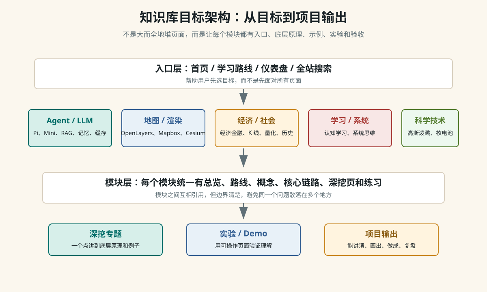

> Architecture

# 整个知识库应该长成什么样

这个站点的目标不是把所有资料都收集进来，而是把复杂系统拆成可学习、可解释、可实验、可复盘的知识模块。每个模块都要能回答一个问题：我如何从一个具体例子理解它的底层原理，并最终做出一个小作品或讲清一条链路。



## 一、这次诊断发现的问题

| 问题 | 表现 | 优化方向 |
| --- | --- | --- |
| 首页承担太多职责 | 首页既放路线、工具箱、模块卡片，又重复一套模块 roadmap，顶部导航也过长。 | 首页只做目标入口和少量推荐，把全量目录交给模块页和搜索。 |
| 模块目录缺少分组 | 十八个模块并列展示，后续再增长会变成长列表。 | 按 Agent/AI、地图渲染、经济社会、哲学信仰、学习系统、科学技术分组。 |
| 仪表盘内容过期 | 页面仍写“十二个模块”，没有覆盖历史社会、认知学习、系统思维等新增模块。 | 改成全局驾驶舱：学习轨道、当前重点、验收问题。 |
| 部分新专题入口弱 | 例如“角色优先级与缓存”已经有内容，但全局路线和模块目录入口不足。 | 把新专题纳入 LLM/Agent 路线、模块目录和搜索索引。 |
| 深挖标准需要显式化 | 有些页面是资料型，有些页面是原理型，读者不容易判断学习目标。 | 统一“概念 -> 底层链路 -> 例子 -> 误解 -> 自测 -> 实验”的深挖模板。 |

## 二、最终形态

```text
首页：回答“我该从哪里开始”
学习路线：按目标组织跨模块路径
全部模块：按知识域分组，回答“这个模块里有什么”
模块首页：回答“这个模块解决什么问题、先学哪几页”
深挖页：每次只打穿一个底层点
实验页：用可操作 demo 验证概念
仪表盘：追踪当前重点、下一步和验收问题
搜索/概念索引：用于回查，不承担主路线
```

## 三、合并与拆分原则

- 同一个用户目标，合并到同一条路线： 比如 Agent 实战路线可以串 Pi 源码、Mini Agent、模型兼容、记忆、RAG 和前端事件流。

- 同一个底层原理，拆成独立深挖页： 比如 while 循环底层、toolCall 闭环、Embedding 召回、Prompt/KV Cache。

- 兼容跳转页保留： 旧 `pages/` URL 不直接删除，避免外部链接失效；新内容以 `modules/` 为准。

- 图片只服务理解： 只有当结构、流程、层级或反馈关系很难用文字扫清时才加图。

- 每个模块都要有验收问题： 读完不是“看过”，而是能说清、画出、做成、复盘。

## 四、接下来逐步优化

| 优先级 | 动作 | 原因 |
| --- | --- | --- |
| P0 | 收敛首页、模块目录、仪表盘。 | 已完成第一轮，入口现在按目标和知识域分工。 |
| P1 | 统一每个模块首页的结构。 | 已开始：经济金融、数字孪生、系统思维先补齐目标、顺序、深挖、实验和验收。 |
| P1 | 把重复的全局列表迁移到路线页或模块目录。 | 减少维护同一份信息的多个版本。 |
| P1 | 拆分过长的教程型首页。 | Mini Agent 首页包含完整 MVP 代码，下一步应拆出独立 MVP 教程页，让 index 回到模块入口职责。 |
| P2 | 补齐重点模块图示。 | Agent loop、RAG、地图渲染、经济循环、系统反馈都适合图解。 |
| P2 | 增加模块级自测和项目输出。 | 让知识库从阅读站变成训练系统。 |
